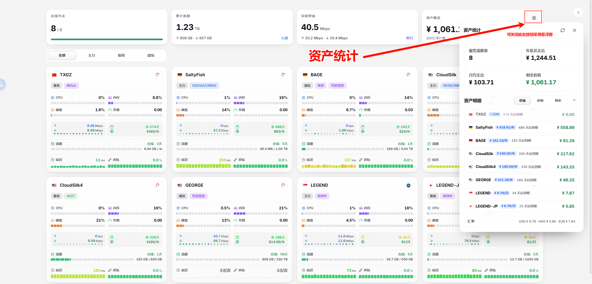
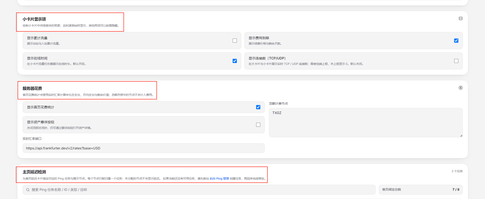
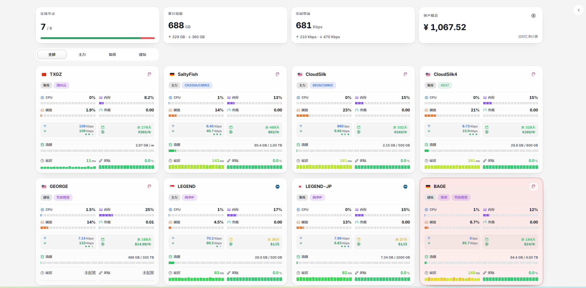

# Komari-Theme-LuminaPlus

一直以来，比较支持这样一个观点：**如果有比较特殊的需求，并且自己具备相关能力，最好可以进行二次开发** 原因主要有几点：
1. 需考虑大方向设计维护。毕竟公用产品，但每个兄弟的审美、习惯和需求都有所不同，“众口难调”，自己喜欢的才是最好的。
2. 能力、精力有限。 我是后端开发，前端也仅是通过Vibe Coding完成。如果兄弟具备前端开发能力，最好是再开发。
3. 版本存在滞后性。 有问题或者好建议我会记录并后续版本中处理。但现实本职+生活影响，时间并非充裕。
产品最初的价值和目标，是希望兄弟们用得、看得、体验舒服。所以，无论是建议、功能优化、交互逻辑、设计思路，还是发现 Bug，都非常欢迎积极、开放地提交 Issue。

基于 [komari-theme-Lumina](https://github.com/stqfdyr/komari-theme-Lumina) 的增强分支。感谢原作者 [stqfdyr](https://github.com/stqfdyr) 开源 Lumina 主题。

## 效果预览

<p align="center">
  
</p>

### 首页总览与节点卡片

首页总览展示在线节点、实时带宽、累计流量与资产概览；节点卡片支持大卡和紧凑卡视图。

<p align="center">
  
</p>

<p align="center">
  
</p>

<p align="center">
  
</p>

<p align="center">
  
</p>

### 透明背景

背景图与卡片透明度可在主题管理中配置，支持大卡片、小卡片和移动端布局。

<p align="center">
  
</p>

<p align="center">
  
</p>

<p align="center">
  
</p>

<p align="center">
  
</p>

### 实例详情

实例详情页优化 Ping 与负载图表展示，支持断点连线、手动刷新和更稳定的图表尺寸。

<p align="center">
  
</p>

<p align="center">
  
</p>

<p align="center">
  
</p>

<p align="center">
  
</p>

### 移动端

移动端总览卡片采用更紧凑的信息展示，保留关键指标。

<p align="center">
  
</p>

<p align="center">
  
</p>

<p align="center">
  
</p>

<p align="center">
  
</p>

### 资产统计

资产统计界面整合入口、指标、明细与汇率信息。

<p align="center">
  
</p>

### 主题管理

主题管理提供小卡片在线时间、资产统计等显示项开关。

<p align="center">
  
</p>

### 离线状态

离线节点保持清晰的状态提示，同时保留最近一次上报的关键指标。

<p align="center">
  
</p>

## 致谢

特别感谢 [stqfdyr/komari-theme-Lumina](https://github.com/stqfdyr/komari-theme-Lumina)。

也感谢 Komari 官方主题、Mochi 等主题项目为 Komari 生态提供的设计和实现思路。

## 参考

- [Komari](https://github.com/komari-monitor/komari)
- [komari-theme-Lumina](https://github.com/stqfdyr/komari-theme-Lumina)
- [komari-theme-purcarte](https://github.com/Montia37/komari-theme-purcarte)
- [Komari 主题开发文档](https://komari-document.pages.dev/)

## 本地 UI 审查

无需连接 Komari 后端也可以检查完整数据界面：

```bash
npm run dev -- --host 0.0.0.0
```

打开开发地址并追加 `?mock=1`。该模式只在 Vite 开发环境启用，会提供正常、高负载、临期、离线、多地区与多币种节点；生产构建不会包含这份测试数据。去掉查询参数即可恢复真实接口。

## Star History

<a href="https://www.star-history.com/?repos=shanyang242%2FKomari-Theme-LuminaPlus&type=timeline&legend=bottom-right">
 <picture>
   <source media="(prefers-color-scheme: dark)" srcset="https://api.star-history.com/chart?repos=shanyang242/Komari-Theme-LuminaPlus&type=timeline&theme=dark&legend=bottom-right" />
   <source media="(prefers-color-scheme: light)" srcset="https://api.star-history.com/chart?repos=shanyang242/Komari-Theme-LuminaPlus&type=timeline&legend=bottom-right" />
   
 </picture>
</a>
